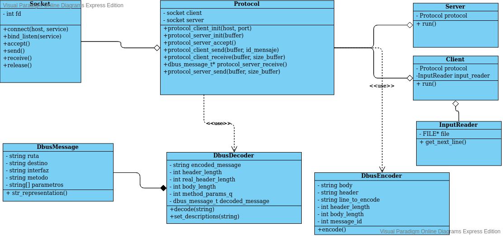
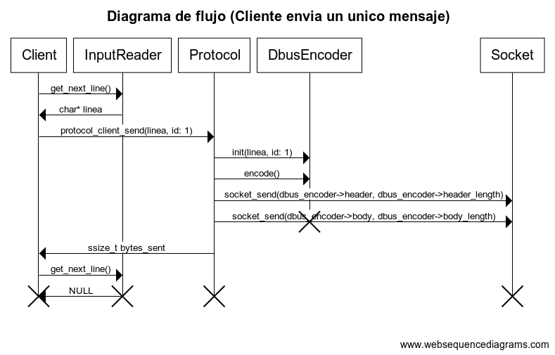
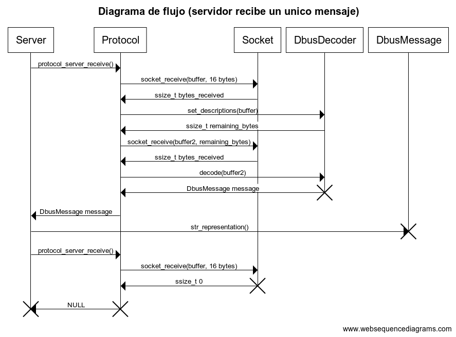

Padron: 98757
Nombre: Pinto Tomas Eduardo
Repositorio: https://github.com/pintotomas/tp1

## Descripcion

El problema se trata de replicar el protocolo DBUS utilizando sockets TCP/IP en vez de el que utiliza originalmente, UNIX. Para ello se codifico en C un cliente y un servidor que se comunican a traves de sockets, mediante la clase protocolo, que codifica y decodifica los mensajes (utilizando las clases dbus decoder y dbus encoder). Para codificarlos el cliente lee de la entrada estandar o de un archivo que reciba por parametro los mensajes, el protocolo los codifica, y los envia al servidor. Este muestra lo recibido y le responde al cliente OK.

## Diagramas

## Aclaraciones

- Falta documentacion de funciones
- Falta manejo de algunas funciones que puedan fallar
- Falta refactorizar algunos metodos de la clase dbus_encoder ya que me quedaron muy largos
- Falta agregar static a algunas funciones privadas en dbus.c
- Falta exportar algunos metodos estaticos (privados) de dbus.c a nuevas librerias
